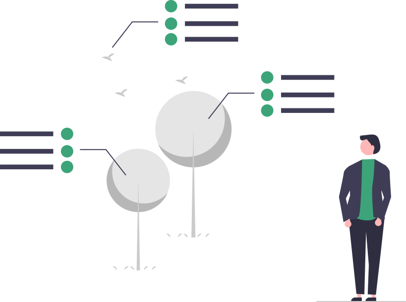

<h1 align="center">Hi , I'm Patel Jay </h1>

  

<b>🌟 Unfold My Jorney 🌟</b>

## ℹ️ About Me

 
  
<b>👱‍♂️ Intro</b>

   
  

    
    

        
🫠&nbsp;Pursuing my B.tech Degree In Information and Communication Technology From PDEU.

        
💙 &nbsp;A Passionate Techie who Loves to take New Challenges in life and to concur it.

        
✨ &nbsp;Busy In Crafting My Future Success Story.

        
📘 &nbsp;Always Motivated to Learn Something New Everyday.

        
♟️ &nbsp;Like to Play Chess in My Free Time.

    

  

 

 
  
<b>💻 Experience</b>

   
  

    
    

        
🢠&nbsp;Full Stack Web Developer At <a href="https://www.infopercept.com">Infopercept Consulting</a> &nbsp;&nbsp;<i>(Apr 2021 - Present)</i>

        
🌈 &nbsp;Beta Student Ambassador At <a href="https://studentambassadors.microsoft.com/">Microsoft Learn Student Ambassador</a> &nbsp;&nbsp;<i>(Jan 2021 - Present)</i>

        
👨‍💻 &nbsp;Web Head At <a href="https://encodepdeu.org">Encode - The Computer Science Club</a> &nbsp;&nbsp;<i>(Oct 2020 - Present)</i>

        
🫠&nbsp;Technical Member At <a href="https://csi-india.org.in">Computer Society of India</a> &nbsp;&nbsp;<i>(Nov 2020 - Present)</i>

        
🌠&nbsp;Web Developement Member At <a href="https://dsc.community.dev/pandit-deendayal-petroleum-university">Developer Student Club</a> &nbsp;&nbsp;<i>(Nov 2020 - Present)</i>

    

  

 

 
  
<b>⚡ Current State</b>

   
  

    
    

        
📗 &nbsp;I am Currently Learning Node.js, ML

        
🚧 &nbsp;I am Currently Working on <a href="https://github.com/jaypatel31/Nodejs-Example">Nodejs Project</a>.

        
📠&nbsp;I am also Enrolled in the <a href="www.udacity.com/scholarships/aws-machine-learning-scholarship-program">AWS ML Scholar Programm.</a>

        
💬 &nbsp;Feel free to Reach out to me for any Tech Related Stuffs.

    

  

 

## 🛠️ My Skills

 
  
<b>👉 Frontend Development</b>

   
  

      
      
      
      
      
    
  

 

 
  
<b>👉 Programming languages</b>

   
  
 
      
      
      
  

 

 
  
<b>👉 Frameworks</b>

   
  
 
      
      
      
      
      
      
      
      
      
      
  

 

 
  
<b>👉 Databases & Cloud Hosting</b>

   
  
 
      
      
      
      
  

 

 
  
<b>👉 Tools</b>

   
  
 
      
      
      
      
  

 

## 📊 Stats

 
  
<b>💻 GitHub Profile Stats</b>

   
  

    

    

    

  

    

 

  
<b>⚡ Recent GitHub Activity</b>

   
   
   

 

## 🔗 Let's Connect

  
	
	
	
	

<b>Though you have came this far, Checkout my Repos ⬇️</b>

